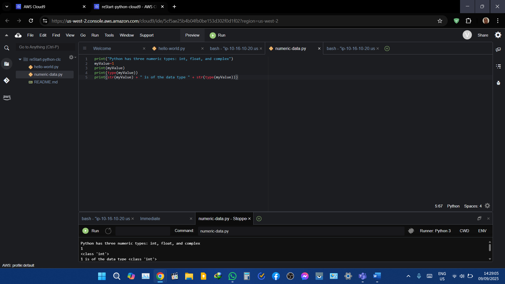
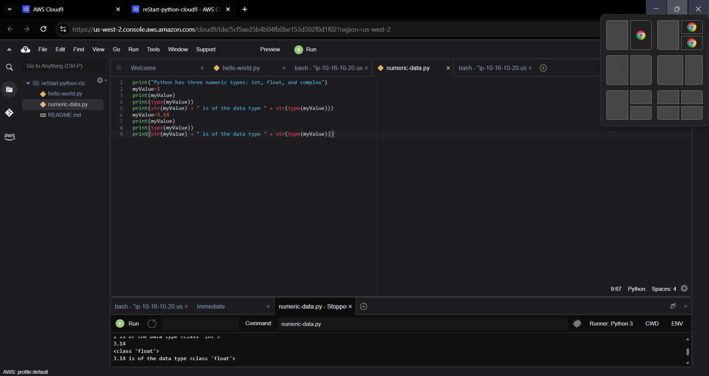
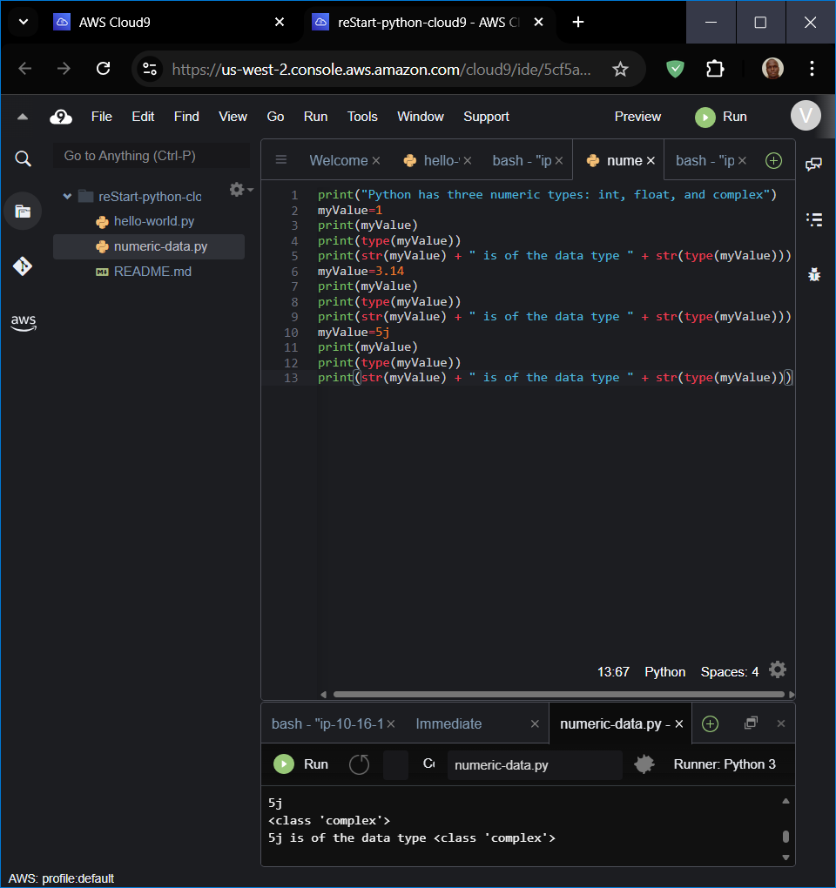
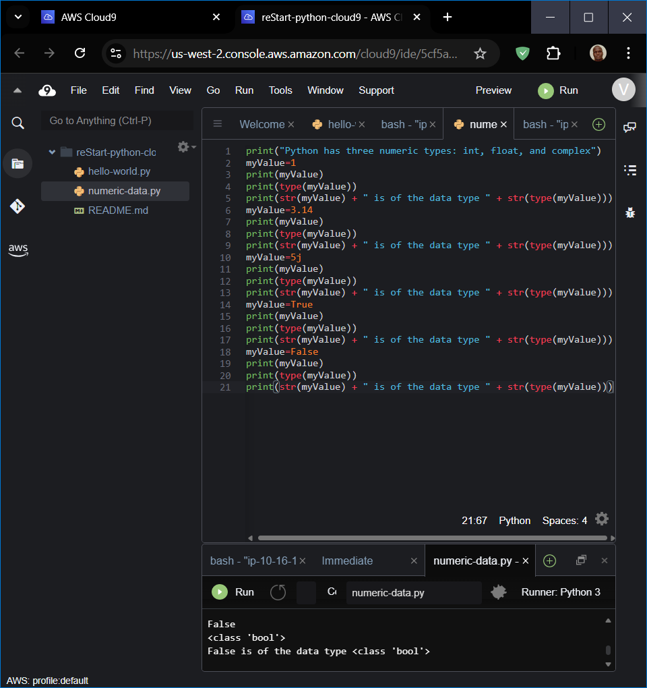

# Working with Numeric Data Types

## Introducing the int data type

**Creating a variable**

**Introducing the float data type**

**Introducing the complex data type**

**Introducing the bool data type**

##Working with the String Data Type

**Introducing the string data type**
